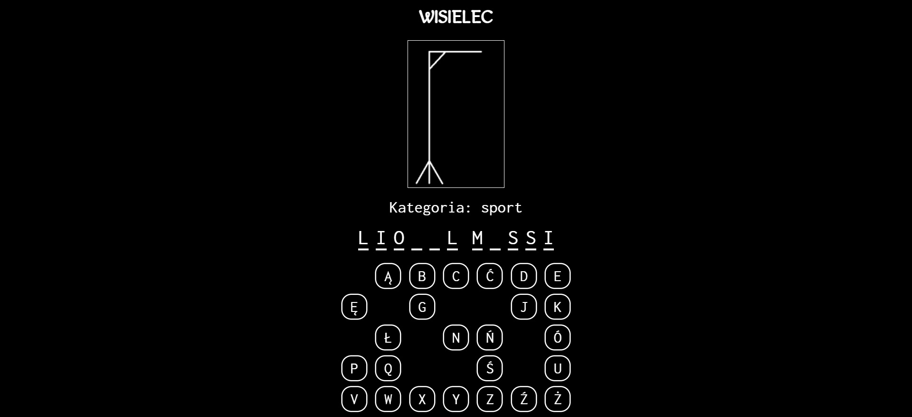
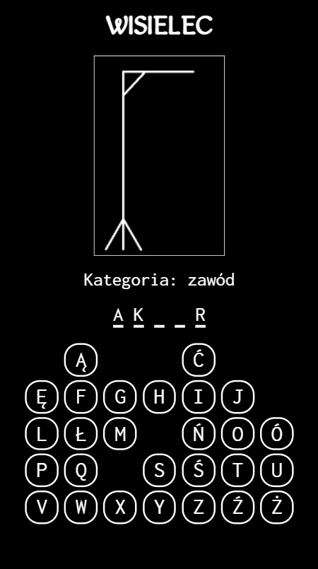

# Wisielec
My first game project after learning procedural programming in javascript. Project also realized with HTML and CSS.

## Table of contents
* [General info](#general-info)
* [Technologies](#technologies)
* [Setup](#setup)
* [Screenshots](#screenshots)
* [Demo](#demo)

## General info
Hangman is a word party game. Your goal is to guess words based on its category and length. You guess the word by selecting a single letter which is checked. If the letter appears in a word, you are informed of the place where the letter appears. In the absence of a letter, a dash by dash is built. Guess the words and get satisfaction, just be careful not to hang.

## Technologies
* HTML5
* CSS3
* JavaScript

## Screenshots
 

## Demo
* A live demo can be found [here](https://mobbyschiller.github.io/)

